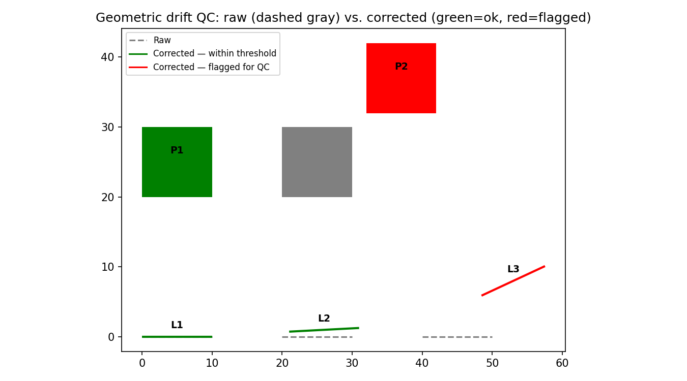

# Geometric Drift QC

Compares a "raw" version of a spatial dataset against a "corrected"
version (matched by a shared feature ID) and quantifies how far each
feature moved and how much its orientation changed — flagging features
that exceed a threshold for QC review before delivery.

## The problem

Spatial features are often adjusted after an initial digitization or
extraction pass. Most corrections are minor; occasionally a feature
shifts or rotates significantly, which usually signals either a
genuine correction worth double-checking or a digitization error
introduced during the fix. Reviewing every feature manually doesn't
scale — this quantifies the actual positional and angular change per
feature and flags only what exceeds a threshold, concentrating QC
effort where it's actually needed.

## Works on points, lines, and polygons

| Geometry | Positional drift | Angular drift |
|---|---|---|
| Point | ✅ distance moved | — (a point has no orientation) |
| Line | ✅ endpoint-to-endpoint shift | ✅ bearing change |
| Polygon | ✅ centroid shift | ✅ orientation change of the minimum rotated bounding rectangle (a general-purpose "which way is it facing" proxy) |

## Demo — verified against known ground truth

`example_usage.py` builds synthetic raw/corrected pairs with
deliberate, known shifts — an unchanged line, a small drift (should
NOT flag), a large drift (should flag), an unchanged polygon, and a
large-drift polygon — and asserts every outcome:



```
Ground-truth verification PASSED:
  L1 (LineString): distance=0.00, angle=0.0, flagged=False
  L2 (LineString): distance=1.25, angle=3.0, flagged=False
  L3 (LineString): distance=10.31, angle=25.0, flagged=True
  P1 (Polygon): distance=0.00, angle=0.0, flagged=False
  P2 (Polygon): distance=16.97, angle=0.0, flagged=True
```

## Usage

```python
from geometric_drift_qc import flag_geometric_drift

result = flag_geometric_drift(
    "raw.geojson", "corrected.geojson",
    id_field="feature_id",
    output_path="drift_flags.geojson",
    distance_threshold=5.0,      # your CRS units
    angle_threshold_deg=10.0,    # lines/polygons only
)
```

**Command line:**
```bash
python geometric_drift_qc.py raw.geojson corrected.geojson feature_id output.geojson --distance-threshold 5 --angle-threshold 10
```

Unmatched IDs — present in one file but not the other — are reported
as warnings, not silently dropped, same honesty-about-gaps principle
used throughout this toolkit.

## Adapting this live to a different schema

Two things typically change dataset to dataset:

```python
flag_geometric_drift(
    "raw.shp", "corrected.shp",
    id_field="span_id",           # whatever your matching ID column is called
    distance_threshold=2.0,       # tune to your data's actual precision/CRS units
    angle_threshold_deg=15.0,
)
```

No code changes needed — both the matching field and both thresholds
are parameters, not hardcoded assumptions.

## Requirements

- **Standalone mode:** `geopandas`, `shapely`
- **QGIS mode:** run inside QGIS (uses `qgis.core`, bundled)
- **Demo only:** `matplotlib`

## Tech stack

Python, Shapely, GeoPandas

## License

MIT
