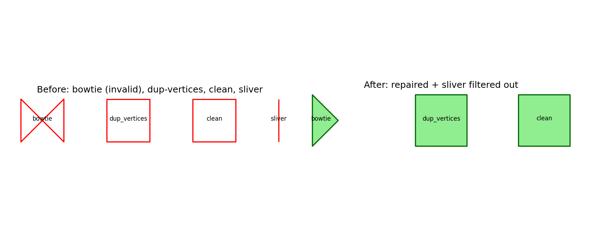

# Geometry Validator & Repair

Detects and repairs common polygon geometry defects — self-intersections,
duplicate/near-duplicate vertices, and invalid topology — across a
single dataset or a folder of datasets. Slivers are filtered out, and
anything that truly can't be fixed is reported separately, never
silently dropped.

## The problem

Polygon datasets accumulate geometry defects from digitization,
coordinate rounding, or upstream processing — self-intersecting rings,
near-duplicate vertices, invalid topology that breaks downstream
spatial operations (area calculations, spatial joins, overlay
analysis). This repairs what can be repaired and flags what can't.

## Repair pipeline

1. **Deduplicate** near-overlapping vertices within each ring
2. **buffer → simplify → buffer(0)** — the standard, well-documented
   GEOS/Shapely technique for repairing self-intersecting polygons
3. **Fallback**: if still invalid, extract ring boundaries as lines,
   union them, and rebuild valid polygons from the resulting line
   network (`shapely.ops.polygonize`)
4. **Filter slivers**: drop parts below a minimum area, or with a
   perimeter-to-area ratio above a threshold
5. **Report, don't drop**: anything unfixable by both methods goes to
   a separate output for manual review

Two threshold presets are provided as a starting point — `"fine"` for
survey-grade/high-precision data, `"coarse"` for lower-precision
mapping data. Both are illustrative defaults; tune to your own data's
actual precision.

## Demo — verified against known ground truth, not just visual

`example_usage.py` builds 4 synthetic polygons with known, deliberate
properties — a classic self-intersecting "bowtie" (invalid by
construction), a polygon with duplicate vertices, an already-valid
polygon, and a sliver too thin to be a real feature — and asserts each
one resolves exactly as expected:



```
Ground-truth verification PASSED:
  - Self-intersecting bowtie -> repaired to valid geometry
  - Duplicate-vertex polygon -> cleaned and kept
  - Already-valid polygon -> passed through
  - Sliver polygon -> correctly filtered out
```

## Usage

```python
from geometry_validator_repair import repair_geometries

repair_geometries(
    "input.shp", "repaired.shp",
    unfixable_path="unfixable.shp",
    preset="fine",   # or "coarse" — see presets above
)
```

**Batch, recursive folder processing:**
```python
from geometry_validator_repair import repair_geometries_batch

repair_geometries_batch("input_folder", "output_folder", unfixable_folder="review_folder")
```

**Command line:**
```bash
python geometry_validator_repair.py input.shp repaired.shp --unfixable unfixable.shp --preset fine
```

## Adapting this live to a different schema

Nothing here depends on specific attribute field names — it operates
purely on geometry. The only thing to adjust for a new dataset is the
**preset or its individual thresholds**, if your data's precision
differs from the two defaults:

```python
repair_geometries("input.shp", "out.shp", preset="fine",
                   min_area=0.01, max_perimeter_area_ratio=30)  # override any single param
```

## Requirements

- **Standalone mode:** `shapely`, `geopandas`
- **QGIS mode:** run inside QGIS (uses `qgis.core`, bundled)
- **Demo only:** `matplotlib`

## Tech stack

Python, Shapely, GEOS, GeoPandas

## License

MIT
