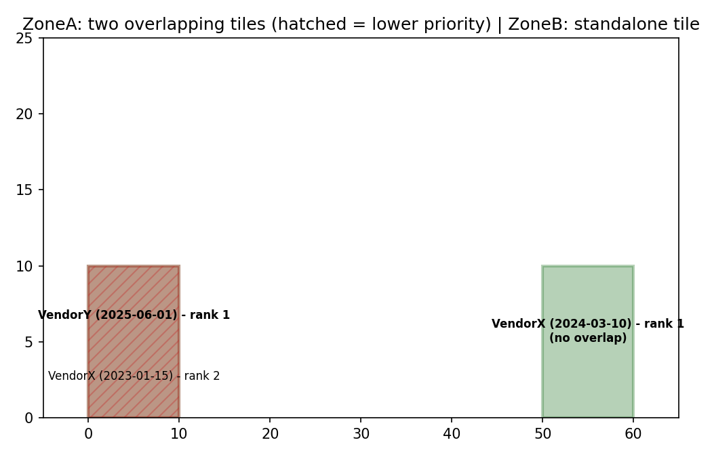

# Imagery Tile Prioritizer

Builds a footprint index across a folder of raster imagery tiles, and
— for tiles whose footprints overlap the same ground area — ranks them
by a priority rule, so downstream mosaicking/compositing knows
explicitly which tile to use where coverage overlaps.

## The problem

When imagery is sourced from multiple vendors/providers, overlapping
coverage is common — the same ground area captured more than once, by
different vendors, at different dates. Picking "whichever tile happens
to load last" isn't a reliable rule. This builds a spatial index of
every tile's footprint plus its metadata, detects overlaps, and ranks
them by a configurable, reproducible priority rule.

## Two priority rules

- **`"recency"`** — most recently acquired tile wins. Tiles missing an
  acquisition-date tag are ranked last within their overlap cluster,
  never assigned a fabricated date to compete.
- **`"vendor_order"`** — a supplied vendor priority list decides,
  regardless of date (useful when one vendor's data is trusted more
  even if it's older).

## Demo — verified against known ground truth for both methods

`example_usage.py` builds 3 synthetic GeoTIFFs with real embedded
metadata tags: two tiles with **identical, deliberately overlapping
footprints** (VendorX, 2023 vs. VendorY, 2025) and one standalone tile
with no overlap:



Both priority methods are asserted against known outcomes, not just
visually inspected:
```
[recency method] PASSED: newer VendorY tile ranked above older VendorX tile; standalone tile unaffected.
[vendor_order method] PASSED: VendorX correctly wins despite being the older tile, per the specified order.
```

## Usage

```python
from imagery_tile_prioritizer import build_tile_index, prioritize_overlapping_tiles, write_tile_index

index = build_tile_index("imagery_folder", date_tag="acquisition_date", vendor_tag="vendor")

ranked = prioritize_overlapping_tiles(index, method="recency")
# or: prioritize_overlapping_tiles(index, method="vendor_order", vendor_order=["VendorX", "VendorY"])

write_tile_index(ranked, "tile_index.geojson")
```

**Command line:**
```bash
python imagery_tile_prioritizer.py imagery_folder tile_index.geojson --method recency
python imagery_tile_prioritizer.py imagery_folder tile_index.geojson --method vendor_order --vendor-order VendorX VendorY
```

## Adapting this live to a different schema

Two things to change for a dataset with different metadata conventions:

```python
build_tile_index(
    "imagery_folder",
    date_tag="capture_date",      # whatever your rasters' date tag is actually called
    vendor_tag="provider_name",   # whatever your rasters' vendor tag is actually called
)
```

If your rasters don't carry these tags at all, the tool still builds
the footprint index — `acquisition_date`/`vendor` just come back as
`None`, reported explicitly (not fabricated), and those tiles rank
last under `"recency"` rather than breaking the run.

## Requirements

- **Standalone mode:** `rasterio`, `geopandas`, `shapely`
- **QGIS mode:** run inside QGIS (uses `qgis.core`/GDAL, bundled)
- **Demo only:** `numpy`, `matplotlib`

## Tech stack

Python, rasterio, GDAL, GeoPandas, Shapely

## License

MIT
