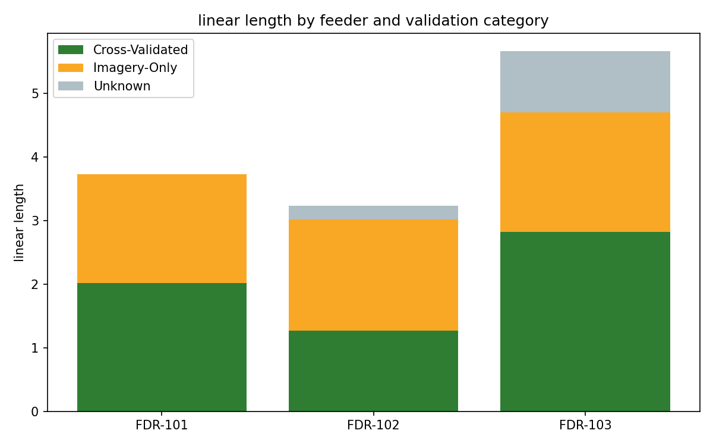

# Linear Network Delivery-Time Estimator, by Feeder

Aggregates line-length attributes across a spatial network, grouped by
feeder, and produces a per-feeder Excel breakdown — including an
estimated delivery time based on which validation method each feature
actually requires.

## The problem

Given a spatial network with a length attribute per feature, produce a
per-feeder summary (total linear length, span count, customer) that a
delivery-planning conversation can actually use — including a time
estimate, so planning isn't just "here's the length" but "here's roughly
how long this will take."

## Category model: reference-source availability, not an arbitrary tier

Some features can be **cross-validated** against recent street-level
imagery in addition to satellite/aerial imagery; others have **no
usable street-level reference** and must be interpreted from imagery
alone. Cross-validation takes longer per line-mile but produces
higher-confidence output. That's a genuine, explainable driver of
delivery time — not an arbitrary difficulty label.

Two ways to classify each feature are supported:

1. **`category_field`** — your dataset already carries a pre-assigned
   category value. Used as-is.
2. **`date_field`** — your dataset carries a capture-date attribute for
   the street-level reference. The tool derives the category itself by
   comparing that date against `recency_threshold_years` (a parameter,
   not a hardcoded constant — "recent" is a moving target).

## Honesty about missing data

If neither a usable category nor a parseable date is available for a
feature, it's classified as **`Unknown`** — its length still counts
toward the feeder's total linear length, but it is explicitly excluded
from the time estimate and reported separately on a **Data Quality**
sheet. The tool never guesses a category to fill a gap.

## Honesty about the time estimate itself

The per-category time-per-mile rates are a **planning-level heuristic**
for resourcing and scheduling — not a precise prediction. The defaults
in this repo are illustrative starting points; calibrate them against
your own historical delivery data before relying on them for real
scheduling. This is stated in the exported workbook's Metadata sheet
as well, not just here.

## Output

A 3-sheet Excel workbook:
- **Feeder Summary** — customer, feeder, span count, total linear length,
  per-category miles and estimated hours, Unknown miles/count
- **Data Quality** — every feeder with Unknown-category features, so
  data gaps are visible rather than silently absorbed into a total
- **Metadata** — generation timestamp, totals, and the time-estimate
  rates used (labeled as illustrative)

## Demo

Synthetic 3-feeder dataset with a realistic mix of recent capture
dates, stale ones, and some missing entirely:



The gray segment is deliberately visible, not hidden — that's the
`Unknown` data-quality gap.

## Usage

```python
import pandas as pd
from linear_network_delivery_estimator import calculate_line_miles_by_feeder, export_to_excel

df = pd.read_csv("feeder_attributes.csv")

results = calculate_line_miles_by_feeder(
    df,
    length_field="segment_length",
    feeder_field="feeder",
    customer_field="customer",
    date_field="streetview_capture_date",   # or category_field=... if pre-classified
    recency_threshold_years=2,               # calibrate to your own definition of "recent"
)

export_to_excel(results, "feeder_delivery_estimate.xlsx")
```

**QGIS Console mode** (reads the active layer's attribute table directly):
```python
from linear_network_delivery_estimator import run_qgis_batch

run_qgis_batch(date_field="streetview_capture_date", output_path="feeder_delivery_estimate.xlsx")
```

**Command line:**
```bash
python linear_network_delivery_estimator.py feeder_attributes.csv output.xlsx --date-field streetview_capture_date
```

## Try it yourself

`example_usage.py` generates a synthetic feeder dataset (with recent,
stale, and missing capture dates), runs the calculation, and produces
both the Excel workbook and the chart above:
```bash
pip install pandas openpyxl matplotlib numpy
python example_usage.py
```

## Requirements

- **Standalone mode:** `pandas`, `openpyxl`
- **QGIS mode:** run inside QGIS (uses `qgis.core`, bundled)
- **Demo only:** `matplotlib`, `numpy`

## Tech stack

Python, pandas, openpyxl, QGIS API

## License

MIT
