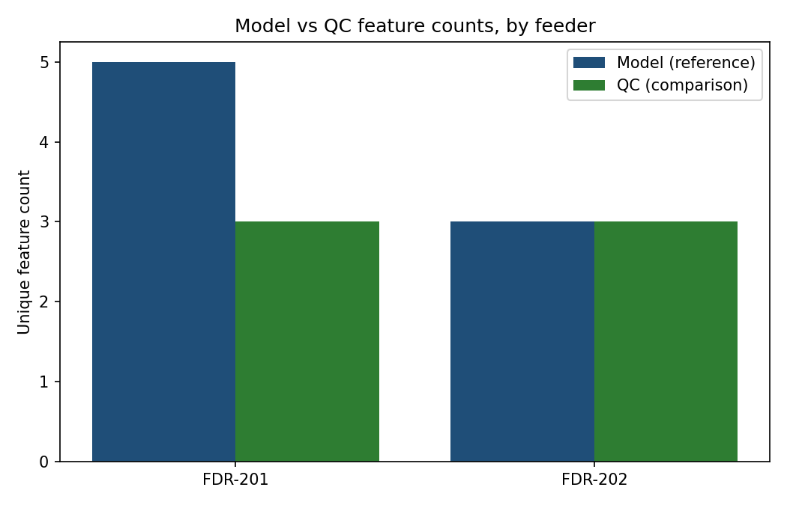

# Polygon Delta QC Engine

Compares two folders of polygon shapefiles — a **reference** dataset
(e.g. an ML model's output) and a **comparison** dataset (e.g. a
QC/vendor-corrected version) — organized one subfolder per
feeder/tile, and reports how many unique features were added or
removed between them, per feeder and per feature ID.

Originally built for tree-health polygon QC (comparing a model's
tree-health output against a human-corrected version to measure
correction volume), but the comparison technique is generic: any
workflow reconciling two versions of a categorized polygon dataset —
crop-boundary corrections, building-footprint QC, land-parcel review —
fits the same pattern. The ID/area column names are configurable, not
hardcoded to the tree-health use case.

## Counting methodology

A feature is identified by the combination of an **ID column** and an
**area column** (defaults: `treeid`, `treearea` — configurable to match
your own schema). Two rows sharing both values are treated as one
feature (duplicates collapse); the same ID with a different area is a
separate feature. Rows where **every** attribute is null/empty are
still counted **individually** — a null polygon is a real feature that
needs review, not noise to discard.

**Deletion** = reference count − comparison count: how many unique
features were present in the reference set but not confirmed in the
comparison set. This is a correction-volume metric, not a correctness
score — it assumes the comparison set is the corrected one.

## Two interfaces

| Interface | File | Use case |
|---|---|---|
| **Headless** | `polygon_delta_qc_engine.py` — `compare_polygon_datasets()` | Scriptable, pipeline-friendly, no GUI dependency |
| **Desktop GUI** | `gui_app.py` | Interactive use — folder browsers, live log, progress bar |

The GUI is a thin wrapper: all comparison logic lives in the headless
module and is fully unit-testable independent of any UI.

## Dependency-free shapefile reading

The attribute-table reader parses the DBF binary format directly — no
`geopandas`/`pyshp`/`dbfread` required for the primary path, with those
three as automatic fallbacks if the raw parser ever fails on an
unusual file. **This is verified, not assumed**: `example_usage.py`
writes shapefiles with `geopandas`/`fiona`, then reads them back with
only the raw parser and asserts the record count matches — proving the
dependency-free path actually works against files it didn't write
itself.

## Demo — verified against known ground truth

`example_usage.py` builds two synthetic feeders with deliberately
known differences (not just a visual demo — an actual correctness
test):

- **FDR-201**: 5 reference features, comparison set kept 3 → **2 deletions expected**
- **FDR-202**: 3 reference features (including 1 null-attribute
  polygon), comparison set kept all 3 → **0 deletions expected**

The script asserts the tool's output matches these exact numbers
before printing success:



```
Ground-truth verification PASSED: deletions match expected values exactly.
```

## Usage

**Headless / scriptable:**
```python
from polygon_delta_qc_engine import compare_polygon_datasets

compare_polygon_datasets(
    "path/to/reference_folder", "path/to/comparison_folder",
    "output/Delta_QC_Report.xlsx",
    id_column="treeid", area_column="treearea",       # or your own schema
    reference_label="Model", comparison_label="QC",   # or your own terms
)
```

**Desktop GUI:**
```bash
python gui_app.py
```

Folder structure expected for both interfaces — one polygon shapefile
per feeder subfolder:
```
reference_folder/
  FDR-201/FDR-201_model.shp (+ .dbf, .shx, ...)
  FDR-202/FDR-202_model.shp
comparison_folder/
  FDR-201/FDR-201_qc.shp
  FDR-202/FDR-202_qc.shp
```

## Try it yourself

```bash
pip install geopandas shapely fiona openpyxl pandas matplotlib
python example_usage.py
```
This builds the synthetic shapefiles, runs the comparison, verifies
the result against known ground truth, and produces the chart above.

## Requirements

- **Headless core:** `pandas`, `openpyxl` (fallback shapefile readers —
  `geopandas`, `pyshp`, or `dbfread` — are optional; only needed if the
  built-in raw DBF parser fails on a given file)
- **GUI:** `PyQt5`
- **Demo/test only:** `geopandas`, `shapely`, `fiona`, `matplotlib`

## Tech stack

Python, pandas, openpyxl, raw DBF binary parsing, PyQt5 (GUI), QThread
(non-blocking UI processing)

## License

MIT
