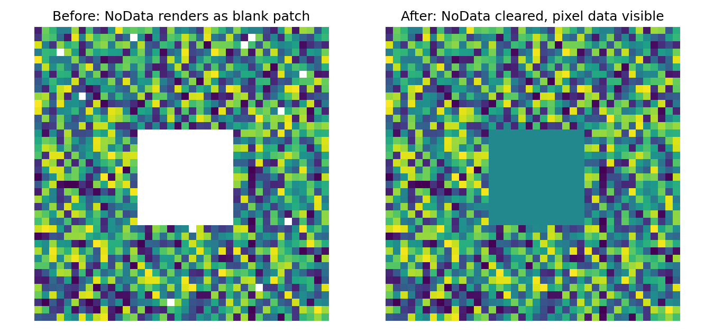

# Raster NoData / White-Patch Cleanup

Removes stale NoData masking from raster imagery that causes blank white
patches to render over valid pixel data — cleared across an entire batch
of rasters in a single pass, rather than fixing one file at a time.

## The problem

Satellite, aerial, and drone imagery is sometimes delivered with an
embedded NoData value that doesn't match the image's actual valid data
range, or that happens to collide with real pixel values. GIS software
then masks those pixels and renders them as blank white patches —
obscuring real ground features underneath. When you're working across a
large set of tiles (an entire imagery network, not a single frame),
fixing this file-by-file is slow. This tool clears the NoData flag
across an arbitrary number of rasters at once.

## How it works

The fix doesn't touch pixel values at all — it only clears the file's
NoData *flag*, so the GIS software stops treating a specific value as
"no data" and renders the true pixel value instead.

Two modes are provided:

| Mode | Where it runs | Use case |
|---|---|---|
| `clean_qgis_project_layers()` | Inside the QGIS Python Console | Interactive cleanup of whatever's currently loaded in a QGIS session |
| `clean_raster_folder()` | Any standalone Python environment (via `rasterio`) | Batch pipelines — clean an entire folder of imagery tiles with no QGIS dependency |

## Before / after

Synthetic demo — a block of valid pixel data whose value collides with
the file's declared NoData value, plus scattered single-pixel collisions
(a realistic pattern for real imagery):



## Usage

**Standalone batch mode** (no QGIS required):
```python
from raster_nodata_cleanup import clean_raster_folder

clean_raster_folder("path/to/imagery_folder", output_folder="path/to/cleaned")
```

**QGIS Console mode** (run inside QGIS):
```python
from raster_nodata_cleanup import clean_qgis_project_layers

clean_qgis_project_layers()
```

**Command line:**
```bash
python raster_nodata_cleanup.py path/to/imagery_folder -o path/to/cleaned
```

## Try it yourself

`example_usage.py` generates a synthetic raster with a simulated
white-patch region, runs the cleanup, and produces the before/after
comparison image above — no real imagery needed:
```bash
pip install rasterio numpy matplotlib
python example_usage.py
```

## Requirements

- **Standalone mode:** `rasterio`
- **QGIS mode:** run inside QGIS's Python Console (uses the bundled
  `qgis.core` API — no separate install)
- **Demo only:** `numpy`, `matplotlib`

## Tech stack

Python, rasterio, GDAL (via rasterio), QGIS API (`qgis.core`)

## License

MIT
