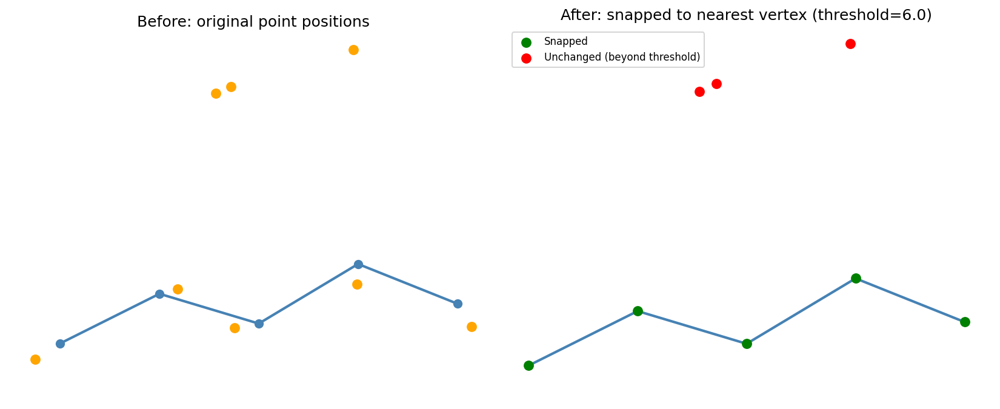

# Spatial Feature Snapping: Point-to-Line-Vertex Automation

Snaps point features onto the nearest vertex of a line network, enforcing
a strict 1:1 relationship — each point can snap to only one vertex, and
each vertex can receive only one point. Points beyond a configurable
distance threshold are left unchanged. The line layer is never modified.

## The problem

Point datasets collected independently from a line network (survey GPS
points, digitized assets, imported point layers) rarely land exactly on
the network's own vertices — small positional drift is common. Manually
nudging each point onto place is slow across a large dataset; this tool
automates the snap while respecting a distance threshold (so it never
force-snaps a point that's genuinely unrelated to the network) and a
1:1 constraint (so two points never collapse onto the same vertex).

Originally built for aligning utility poles onto a conductor-line
network — a common electrical T&D data-cleanup task — but the technique
itself is generic: address points to road-centerline nodes, sensor
locations to pipeline junctions, or any point layer that needs to
conflate onto an existing line network's vertices.

## How it works

1. Collect every vertex from the line layer
2. For each point, find its nearest vertex and the distance to it
3. Keep only candidate matches within `snap_threshold`
4. Resolve matches closest-first, skipping any point or vertex that's
   already been claimed — this enforces the 1:1 constraint
5. Move matched points onto their assigned vertex; leave everything
   else untouched

## Before / after

Synthetic demo — a zig-zag line network with 8 points scattered nearby:
5 within the snap threshold of a vertex, 3 deliberately placed too far
away:



## Usage

**Standalone mode:**
```python
from spatial_feature_snapping import snap_points_to_lines

result = snap_points_to_lines(
    "points.geojson", "lines.geojson",
    snap_threshold=6.0,
    output_path="points_snapped.geojson",
)
```

**QGIS Console mode** (operates on layers already loaded in the project):
```python
from spatial_feature_snapping import snap_points_to_lines_qgis

snap_points_to_lines_qgis("Point_Layer_Name", "Line_Layer_Name", snap_threshold=6.0)
```

Both modes add a `snapped` field (`Yes`/`No`) so you can immediately see
which points were adjusted.

## Try it yourself

`example_usage.py` generates a synthetic line network and point set,
runs the snap, and produces the before/after comparison above — no real
network data needed:
```bash
pip install geopandas shapely matplotlib numpy
python example_usage.py
```

## Requirements

- **Standalone mode:** `geopandas`, `shapely`
- **QGIS mode:** run inside QGIS (uses `qgis.core`, bundled)
- **Demo only:** `matplotlib`, `numpy`

## A note on scale

The nearest-vertex search here is brute-force (O(points x vertices)),
which is fine up to tens of thousands of points/vertices. For much
larger networks, swap the inner loop for a KD-tree (`scipy.spatial.cKDTree`)
— the snapping and 1:1-resolution logic stays identical.

## Tech stack

Python, GeoPandas, Shapely, QGIS API

## License

MIT
