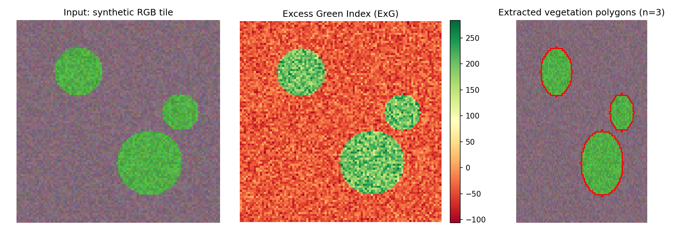

# Vegetation Extraction from RGB Imagery (Excess Green Index)

Extracts vegetation — trees, bushes, grass, general plant cover — from
RGB satellite, aerial, or drone imagery as clean vector polygons, using
the Excess Green Index (ExG), a standard vegetation index that works
with ordinary RGB bands (no near-infrared required).

```
ExG = (2 x Green) - Red - Blue
```

## The problem

Given a raster tile or an AOI covering a network of tiles, produce a
usable vector layer of "where is the vegetation" — rather than a raw
raster mask — for downstream use in vegetation-encroachment checks,
land-cover context, or any workflow that needs vegetation as
queryable/editable polygons.

## How it works

1. Compute ExG per pixel from the R/G/B bands
2. Threshold ExG to produce a binary vegetation mask (default: 30 — a
   commonly used starting point in the remote-sensing literature; tune
   per imagery source and lighting conditions)
3. Optional: require green to dominate red and blue (`use_green_dominance`)
   — a stricter mode that reduces false positives from surfaces that can
   register a high ExG value in some imagery (certain soil/urban tones)
4. Remove small speckle blobs (sieve-equivalent, connected-component
   filtering)
5. Polygonize the cleaned mask and write vector output

Two modes are provided:

| Mode | Where it runs | Output |
|---|---|---|
| `extract_vegetation` / `extract_vegetation_batch` | Any standalone Python environment (rasterio + scikit-image + shapely) | GeoJSON |
| `run_qgis_batch` | Inside QGIS (QGIS Processing framework: sieve, polygonize, extract-by-expression, optional AOI clip and merge-all) | Shapefile |

## Before / after

Synthetic demo — RGB tile with 3 simulated vegetation patches over a
non-vegetated background, its ExG heatmap, and the final extracted
polygons overlaid:



## Usage

**Standalone mode, single raster:**
```python
from vegetation_extraction import extract_vegetation

extract_vegetation("tile.tif", "tile_vegetation.geojson", threshold=30)
```

**Standalone mode, batch folder:**
```python
from vegetation_extraction import extract_vegetation_batch

extract_vegetation_batch("path/to/imagery_folder", "path/to/output_folder", threshold=30)
```

**Command line:**
```bash
python vegetation_extraction.py path/to/imagery_folder path/to/output_folder --threshold 30
```

**QGIS Console mode** (full Processing framework — sieve, AOI clip, merge-all):
```python
from vegetation_extraction import run_qgis_batch

run_qgis_batch("path/to/imagery_folder", "path/to/output_folder", threshold=30)
```

## Try it yourself

`example_usage.py` generates a synthetic RGB raster with simulated
vegetation patches, runs extraction, and produces the demo image above
— no real imagery needed:
```bash
pip install rasterio numpy matplotlib shapely geopandas scikit-image
python example_usage.py
```

## Requirements

- **Standalone mode:** `rasterio`, `numpy`, `scikit-image`, `shapely`, `geopandas`
- **QGIS mode:** run inside QGIS (uses `qgis.core` / `processing`, bundled)
- **Demo only:** `matplotlib`

## Tech stack

Python, rasterio, scikit-image, shapely, GeoPandas, QGIS API

## License

MIT
